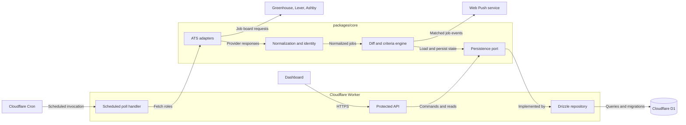

# Architecture

This is the target architecture for the single-user prototype. Components shown
as planned are implemented as their corresponding epics are completed.

## Data Flow

1. Cloudflare Cron invokes the Worker poll handler. The dashboard uses the
   protected API for manual operations and read models.
2. Core adapters fetch job boards from the supported ATS platforms.
3. Core normalization derives provider-neutral jobs plus `sourceKey` and
   `stableKey`. The diff engine compares those jobs with durable ledger state
   and evaluates criteria.
4. The engine uses the persistence port. The Worker implements that port with a
   Drizzle repository backed by D1.
5. Matched jobs flow to Web Push delivery. The dashboard reads the resulting
   state through the API.

## Dependency Rules

- `packages/core` must not depend on Cloudflare Workers, D1, Drizzle, or the
  DOM.
- `apps/worker` owns Cloudflare bindings, scheduling, API routes, Drizzle, D1,
  and push integration.
- ATS adapters do not depend on storage details.
- The diff engine does not query Drizzle or D1 directly; it uses the core
  persistence port.

See [ADR 0001](adr/0001-domain-persistence-boundary.md) for the decision and
its consequences.
